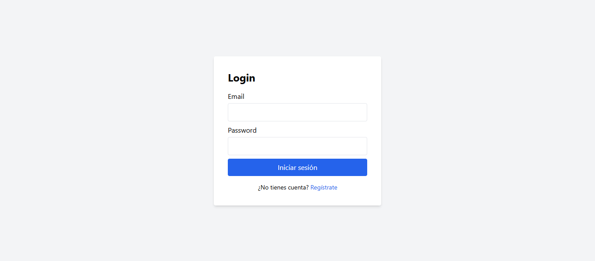
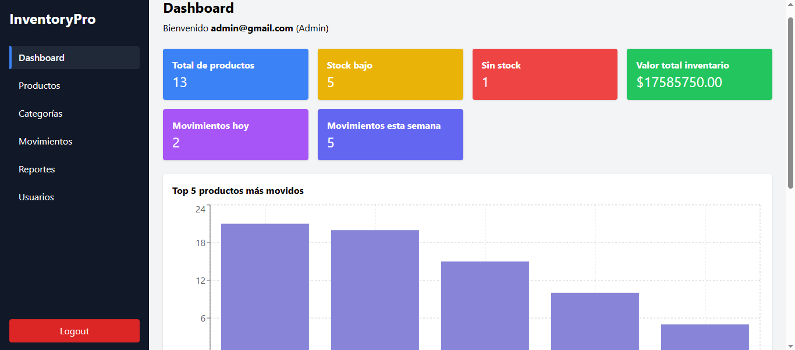
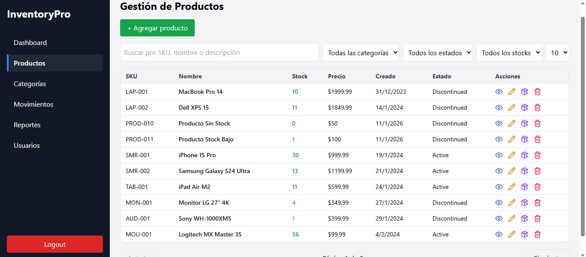
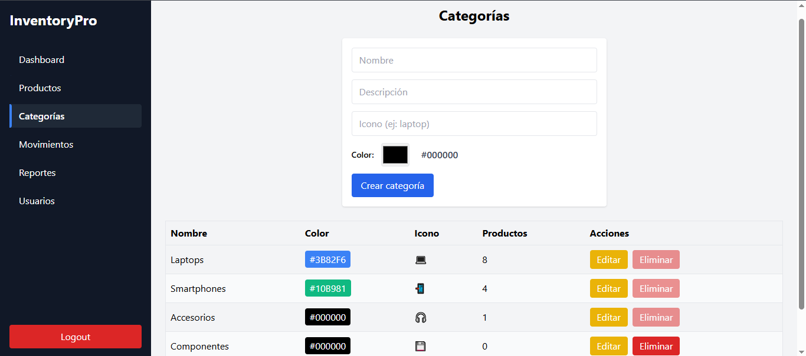
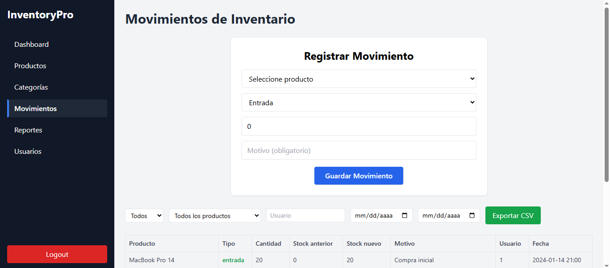

# React + TypeScript + Vite
📦 InventoryPro

InventoryPro es una aplicación web completa de gestión de inventario, desarrollada con React y TypeScript, que incluye autenticación, autorización por roles, dashboard analítico y gestión integral de productos, categorías, movimientos y usuarios.

🧾 Descripción del proyecto

InventoryPro permite:

🔐 Autenticación y autorización de usuarios con control de roles

📊 Dashboard con métricas clave del inventario

📦 CRUD completo de productos

🗂️ Gestión de categorías

🔄 Registro y control de movimientos de stock

📈 Reportes de inventario

👥 Gestión de usuarios (rol administrador)

El proyecto fue desarrollado cumpliendo estrictamente los Requisitos Funcionales (RF-01 a RF-07) solicitados en la consigna.
🛠️ Tecnologías utilizadas
| Área                 | Tecnologías           |
| -------------------- | --------------------- |
| Frontend             | React, TypeScript     |
| Estilos              | Tailwind CSS          |
| Routing              | React Router          |
| Gráficos             | Recharts              |
| Comunicación HTTP    | Axios                 |
| Autenticación        | JWT (simulado / mock) |
| Backend simulado     | json-server           |
| Build Tool           | Vite                  |
| Control de versiones | Git & GitHub          |
RF-01: Autenticación y Autorización
Funcionalidades implementadas

✅ Pantalla de Login con validación de campos
✅ Pantalla de Registro de nuevos usuarios
✅ Manejo de sesión mediante JWT simulado
✅ Persistencia de sesión (recordar usuario)
✅ Rutas protegidas según autenticación
✅ Autorización por roles (Admin / Operador)
✅ Logout con limpieza de sesión
✅ Manejo de token expirado

Criterios cumplidos

✔ Usuario no autenticado es redirigido a /login
✔ Operador no puede acceder a rutas administrativas
✔ Token inválido o expirado redirige a login
✔ Mensajes de error claros para credenciales incorrectas

📊 RF-02: Dashboard Principal
Métricas implementadas

✅ Total de productos registrados
✅ Productos con stock bajo
✅ Productos sin stock
✅ Valor total del inventario (stock × costo)
✅ Movimientos recientes (día / semana)
✅ Top 5 productos con más movimientos

Componentes visuales

Cards de resumen con iconos

Gráfico de movimientos (Recharts)

Tabla de alertas de stock bajo

Lista de últimos movimientos

📦 RF-03: Gestión de Productos (CRUD Completo)
Listado de productos

✅ Tabla con paginación
✅ Ordenamiento por columnas
✅ Búsqueda por SKU, nombre o descripción
✅ Filtros por categoría, estado y stock bajo
✅ Indicadores visuales de estado de stock
✅ Acciones: ver, editar, eliminar, ajustar stock

Crear / Editar producto

✅ Formulario dedicado
✅ Validación completa de campos
✅ SKU único
✅ Selector de categoría
✅ Preview de imagen por URL
✅ Confirmación antes de guardar

Detalle de producto

✅ Vista completa del producto
✅ Historial de movimientos
✅ Acciones rápidas

Eliminación

✅ Confirmación previa
✅ Soft delete (status: discontinued)

🗂️ RF-04: Gestión de Categorías

✅ CRUD completo de categorías
✅ Campos: nombre, descripción, color, icono
✅ Conteo de productos por categoría
✅ Restricción para eliminar categorías con productos asociados

🔄 RF-05: Movimientos de Inventario
Registro

✅ Entrada / salida / ajuste
✅ Selector de producto
✅ Validación de stock disponible
✅ Motivo obligatorio
✅ Actualización automática del stock

Historial

✅ Tabla de movimientos
✅ Filtros por tipo, producto y fecha
✅ Indicadores visuales por tipo
✅ Exportación opcional (CSV)

📈 RF-06: Reportes

✅ Reporte de inventario actual
✅ Reporte de productos con stock bajo
✅ Reporte de movimientos por período
✅ Valorización del inventario
✅ Vista previa en pantalla
🟡 Exportación PDF (opcional)

👥 RF-07: Gestión de Usuarios (BONUS)

✅ Listado de usuarios
✅ Crear y editar usuarios
✅ Asignación de roles
✅ Activar / desactivar usuarios
✅ Visualización de último acceso

🚀 Instalación y ejecución
git clone https://github.com/Nelson-Sosa/InventoryPro.git
cd InventoryPro
npm install
npx json-server --watch db.json --port 3001
npm run dev

GESTIONINVENTARIO
├── inventarypro
│   ├── node_modules
│   ├── public
│   ├── src
│   │   ├── assets
│   │   ├── components
│   │   ├── context
│   │   ├── hooks
│   │   ├── pages
│   │   ├── router
│   │   ├── types
│   │   ├── App.css
│   │   ├── App.tsx
│   │   ├── index.css
│   │   └── main.tsx
│   ├── setupTests.ts
│   ├── .gitignore
│   ├── AI_INSTRUCTIONS.md
│   ├── db.json
│   ├── eslint.config.js
│   ├── index.html
│   ├── package-lock.json
│   ├── package.json
│   ├── postcss.config.js
│   ├── prueba.txt
│   └── tsconfig.json
└── README.md
🧠 Decisiones técnicas

React + TypeScript → escalabilidad y seguridad

Tailwind CSS → consistencia visual

JWT simulado → control de acceso realista

Arquitectura modular → mantenibilidad

json-server → backend ágil para pruebas técnicas

